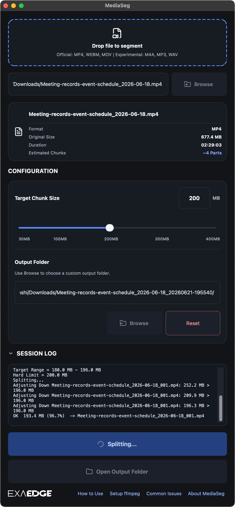
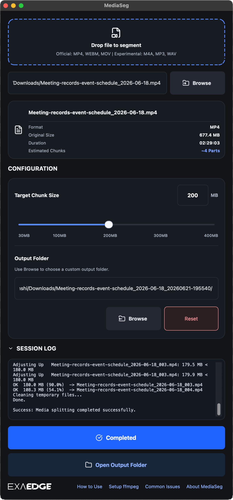

# MediaSeg


Status: Stable

Platform: macOS on Apple Silicon

MediaSeg splits large media files into upload-ready chunks with local processing and a no-re-encode split path for MP4 input.

It was produced and directed with full AI assistance, and shipped in 2 days from idea to public release.

- [Project page](https://exaedge.ai/our-projects/media-split-tool-mediaseg/)
- [Latest release](https://github.com/exaedge/MediaSeg/releases/latest)
- [GitHub Issues](https://github.com/exaedge/MediaSeg/issues)

## Overview

MediaSeg is a local macOS utility for splitting large media files into upload-ready chunks.

- Local processing only
- Default target chunk size: 200MB
- MP4 uses a stream-copy split path without re-encoding
- Official support: MP4, WEBM, MOV
- Experimental support: M4A, MP3, WAV

## Screenshots

<table>
  <tr>
    <td align="center">
      <br>
      1. Splitting
    </td>
    <td align="center">
      <br>
      2. Completed
    </td>
  </tr>
  <tr>
    <td colspan="2" align="center">
      <br>
      3. Review segmented output files
    </td>
  </tr>
</table>

---

## Feedback

For bug reports, feature requests, and other feedback, open a [GitHub Issue](https://github.com/exaedge/MediaSeg/issues).

If you tested MediaSeg with a file that behaved unexpectedly, please include:

- MediaSeg version
- input file format
- approximate file size
- whether the split succeeded or failed

---

## Current Requirements

Officially supported:

- mp4
- webm
- mov

Experimental:

- m4a
- mp3
- wav

Output behavior:

- MP4 -> MP4 with stream copy
- MOV -> MOV
- M4A / MP3 / WAV -> same format output
- WEBM -> converted to MP4 first, then split locally

Chunk sizing:

- Default target chunk size: 200MB
- Uses the configured value as a hard upper bound
- Targets roughly 90%-98% of the limit when possible
- Generates sequential output names in a timestamped folder

```text
Output Folder:
TrainingVideo_20260614-101523/

Files:
TrainingVideo_001.mp4
TrainingVideo_002.mp4
TrainingVideo_003.mp4
```

---

## Installation

```bash
python3 -m venv .venv
source .venv/bin/activate
```

```bash
pip install PySide6
```

```bash
brew install ffmpeg
```

Release builds bundle FFmpeg / FFprobe. Source runs require a local `ffmpeg` / `ffprobe`.

---

## Requirements

- Apple Silicon Mac
- macOS 15 Sequoia or later
- Python 3.13+
- `ffmpeg` / `ffprobe` for source runs
- PySide6 (GUI)

---

## Usage

### CLI

```bash
python3 mediaseg.py "/path/to/video.mp4"
```

```bash
python3 mediaseg.py "/path/to/video.mp4" --max-size 130
```

### GUI

```bash
python3 mediaseg_gui.py
```

If `ffmpeg` or `ffprobe` is missing in a source run, the GUI shows a dependency warning and disables splitting until the dependency is available.

---

## Build macOS App

Use the table below to choose the build path:

| Build type | Use case | Command | Output |
| --- | --- | --- | --- |
| Public | Direct distribution via GitHub or the corporate site | `./build_public.sh` | `dist/MediaSeg.app` + FFmpeg source archive + build configuration |
| Private | Handoff to a specific recipient | `./build_private.sh` | `dist/MediaSeg.app` + `dist/MediaSeg.dmg` + FFmpeg source archive + build configuration |

Both build scripts bundle LGPL-compatible FFmpeg / FFprobe from official source and place the matching source archive and build configuration in `dist/`.

When publishing release binaries, keep the matching FFmpeg source archive on the same download page as the app artifacts and state that MediaSeg uses libraries from the FFmpeg project under the LGPL v2.1.

Run:

```bash
open dist/MediaSeg.app
```

---

## Third-Party Licenses

MediaSeg uses FFmpeg / FFprobe, PySide6 / Qt, and Lucide Icons.

See [THIRD_PARTY_LICENSES.md](THIRD_PARTY_LICENSES.md), which is also available from the app's Help menu in release builds.
