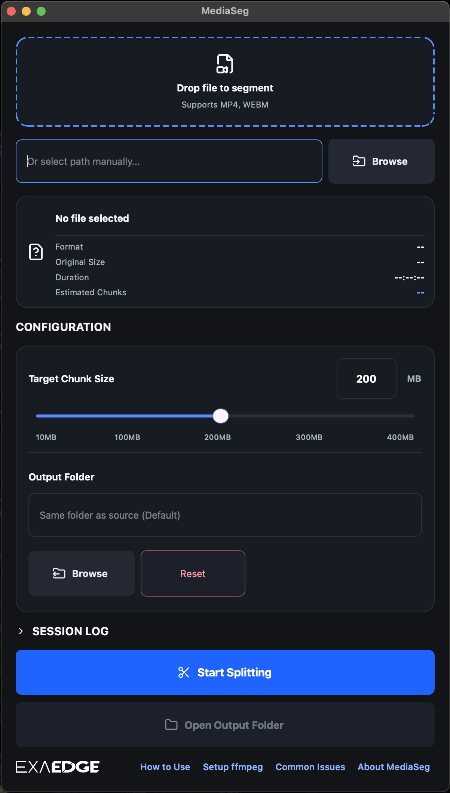
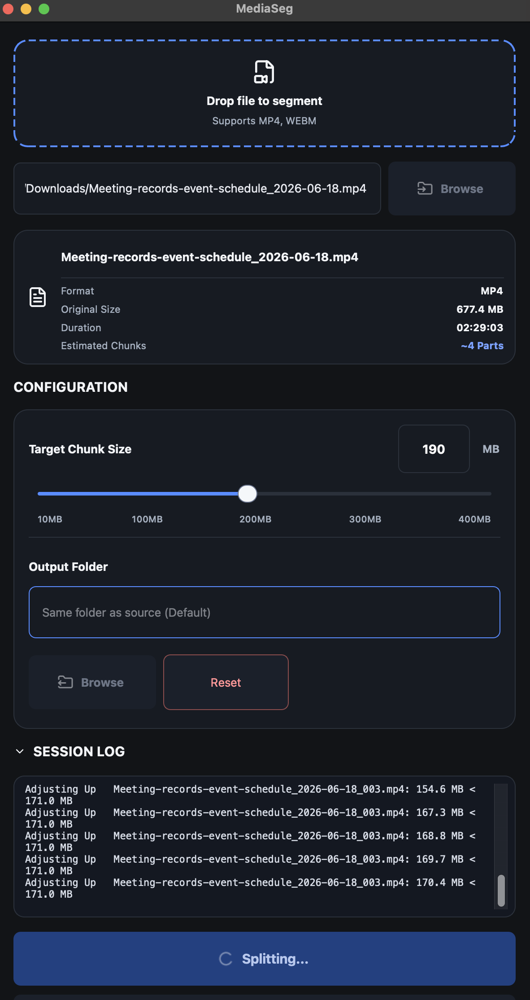
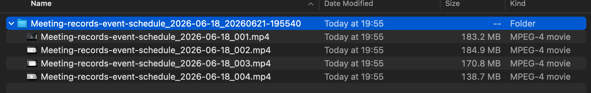

# MediaSeg


Status: Stable

Platform: macOS on Apple Silicon

Default target chunk size: 200MB

MediaSeg splits large media files into upload-ready chunks while preserving quality.

It was produced and directed with full AI assistance, and shipped in 2 days from idea to public release.

- [Project page](https://exaedge.ai/our-projects/media-split-tool-mediaseg/)
- [Latest release](https://github.com/exaedge/MediaSeg/releases/latest)
- [GitHub Issues](https://github.com/exaedge/MediaSeg/issues)

## Overview

MediaSeg is a local macOS utility that splits large media files into upload-ready chunks while preserving quality.

Current primary use case:

- Prepare long-form media for NotebookLM and other size-limited upload workflows
- Split large media files below a configurable size limit
- Preserve original quality whenever possible
- Work entirely on local files

## Screenshots

<table>
  <tr>
    <td align="center">
      <br>
      Initial state
    </td>
    <td align="center">
      <br>
      Splitting
    </td>
  </tr>
  <tr>
    <td colspan="2" align="center">
      <br>
      Output complete
    </td>
  </tr>
</table>

---

## Feedback

For bug reports, feature requests, and other feedback, open a [GitHub Issue](https://github.com/exaedge/MediaSeg/issues).

Please include the app version, macOS version, any steps to reproduce, and the Session Log if available.

---

## Project Structure

The repository is intentionally small, so the main entry points are easy to locate:

- `mediaseg.py`
  - CLI entry point
  - Parses arguments and calls the core splitter
- `mediaseg_core.py`
  - Dependency checks
  - Duration probing
  - Media splitting and output folder creation
- `mediaseg_gui.py`
  - PySide6 desktop UI
  - Drag & drop, file info card, collapsible session log, activity states, output folder selection
- `assets/icons/`
  - Lucide-based SVG icons used by the GUI
- `MediaSeg.spec`
  - PyInstaller build spec for macOS app packaging
- `THIRD_PARTY_LICENSES.md`
  - Third-party license and attribution notes

---

## Current Status

Implemented:

- Local-first splitter core and CLI entry point
- PySide6 GUI with drag & drop, output folder selection, session log, and processing states
- MP4 and WEBM support through local `ffmpeg` / `ffprobe`
- Configurable chunk sizing with target-range optimization
- macOS app packaging support with SVG icons and license handling

## From direction to public release in 2 days

MediaSeg was produced and directed with full AI assistance, and shipped in 2 days.

The point is not that AI can do everything. The point is that strong direction and production can turn an idea into a practical product, fast.

Example:

```bash
python3 mediaseg.py "video.mp4"
```

```bash
python3 mediaseg.py "video.mp4" --max-size 130
```

---

## Current Requirements

### Input

Supported:

- mp4
- webm

Notes on WEBM:

- WEBM files are converted before splitting.
- The conversion step uses local ffmpeg and preserves media quality as much as possible.
- Conversion can take significantly longer than MP4 processing.
- CPU usage may be substantially higher during WEBM conversion.
- Large WEBM recordings may require several minutes before splitting begins.

Planned:

- mov
- mkv
- audio-only formats
- additional formats as needed

### Output

Output files should:

- Preserve original quality whenever possible
- Stay below a configurable size limit
- Attempt to keep chunk sizes within 90%-98% of the configured limit
- Use the configured limit as a hard upper bound
- Default target: 200MB
- Generate sequential names

Example:

```text
Input:
TrainingVideo.mp4

Output Folder:
TrainingVideo_20260614-101523/

Files:
TrainingVideo_001.mp4
TrainingVideo_002.mp4
TrainingVideo_003.mp4
```

---

## Installation

### Create Virtual Environment

```bash
python3 -m venv .venv
source .venv/bin/activate
```

### Install Dependencies

```bash
pip install PySide6
```

### Install ffmpeg for source runs

```bash
brew install ffmpeg
```

If you are not familiar with `brew`:

- `ffmpeg` is the video tool MediaSeg uses for probing, conversion, and splitting.
- `brew` is the package manager used to install it on macOS.
- If Homebrew is missing, install it first, then run `brew install ffmpeg`.
- Inside the app, `Help > Setup ffmpeg` explains the same steps for source runs.

Packaged MediaSeg release builds bundle FFmpeg / FFprobe and do not rely on a system-installed copy.

The GUI uses macOS VideoToolbox for WEBM-to-MP4 conversion, so that path no longer depends on `libx264`.

---

## Requirements

- Apple Silicon Mac
- macOS 15 Sequoia or later
- Python 3.13+
- ffmpeg / ffprobe for source runs
- PySide6 (GUI)

---

## Usage

### CLI

```bash
python3 mediaseg.py "/path/to/video.mp4"
```

```bash
python3 mediaseg.py "/path/to/video.mp4" --max-size 130
```

### GUI

```bash
python3 mediaseg_gui.py
```

Key features:

- Drag & Drop
- Chunk-size control
- Activity indicator for processing states
- SVG icons throughout the UI
- Output Folder selection
- Collapsible SESSION LOG section, closed by default
- Help menu with `How to Use`, `Setup ffmpeg`, `Common Issues`, `Third-Party Licenses`, and `About MediaSeg`

If `ffmpeg` or `ffprobe` is missing:

- MediaSeg shows a dependency warning dialog at startup.
- `Start Splitting` stays disabled until the dependency is available.
- Release builds should already include bundled FFmpeg / FFprobe.
- Source runs can use `Help > Setup ffmpeg` for installation guidance and verification commands.

---

## Build macOS App

Use the table below to choose the build path:

| Build type | Use case | Command | Output |
| --- | --- | --- | --- |
| Public | Direct distribution via GitHub or the corporate site | `./build_public.sh` | `dist/MediaSeg.app` + FFmpeg source archive + build configuration |
| Private | Handoff to a specific recipient | `./build_private.sh` | `dist/MediaSeg.app` + `dist/MediaSeg.dmg` + FFmpeg source archive + build configuration |

Notes:

- Assets (SVG icons) are bundled through MediaSeg.spec.
- Activity Indicator icons require the assets directory to be included in the build.
- THIRD_PARTY_LICENSES.md should be distributed together with release builds.
- Both build scripts compile an LGPL-compatible FFmpeg / FFprobe bundle from official FFmpeg source and include it in the app.
- Both build scripts also place a matching FFmpeg source archive and build-configuration text file in `dist/`.
- The bundling step rejects FFmpeg builds that enable GPL or nonfree options.
- The app includes `Help > Setup ffmpeg` and `Help > Common Issues` for dependency guidance.

If you need to do the private build manually:

```bash
./build_public.sh
codesign --force --deep --sign - dist/MediaSeg.app
```

Then package `dist/MediaSeg.app` into a DMG and keep the matching FFmpeg source archive with the release payload.

Current size notes:

- `dist/MediaSeg.app` without ffmpeg bundled is smaller than the previous bundle
- `dist/MediaSeg.dmg` compresses much smaller than the app folder itself

The DMG is the recommended choice for private handoff when the recipient can use system `ffmpeg` / `ffprobe`.

Run:

```bash
open dist/MediaSeg.app
```

---

## Third-Party Licenses

MediaSeg uses FFmpeg / FFprobe, PySide6 / Qt, and Lucide Icons.

See [THIRD_PARTY_LICENSES.md](THIRD_PARTY_LICENSES.md), which is also available from the app's Help menu in release builds.

---

## Examples

Output folder naming:

```text
MeetingRecording_20260614-101523/
```

Generated files:

```text
MeetingRecording_001.mp4
MeetingRecording_002.mp4
MeetingRecording_003.mp4
```

---

## Chunk Size Strategy

MediaSeg uses a target-based sizing algorithm.

Goals:

- Stay below the configured maximum size
- Prefer chunk sizes close to the target
- Preserve original media quality with ffmpeg stream copy mode (`-c copy`)
- Use macOS VideoToolbox for WEBM conversion

Notes:

- Default size input is 200MB.
- Very variable bitrate media may produce smaller final chunks.
- MediaSeg prefers the best valid chunk below the limit over failure.

---

## Non-Goals

Currently out of scope:

- Cloud processing
- Video editing
- Video compression optimization
- Git integration
- Media transcription

---

## Development Principles

- Local-first
- Simple UX
- Minimal dependencies
- Preserve media quality
- Prefer predictable chunk sizing
- Prioritize reliability over performance

## Primary Use Case

Long-form media often exceeds upload limits imposed by AI tools and knowledge management platforms.

MediaSeg prepares local media files for upload by:

1. Splitting files into smaller chunks
2. Preserving media quality whenever possible
3. Keeping chunk sizes below a configurable limit
4. Optimizing chunk sizes toward 90%-98% of the configured target when possible
5. Falling back to the best valid chunk when exact optimization is not achievable
6. Generating organized output folders automatically
